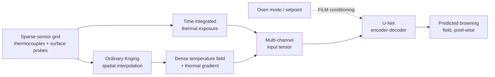

# Heatmap Oven Analysis

**Spatial thermal modeling and deep-learning browning prediction for industrial convection ovens.**

This repository is a portfolio overview of an applied ML/DL engineering project: predicting how baked-good color/browning develops across a tray inside an industrial oven cavity, using a sparse grid of thermocouple and surface-contact sensors as the only input — without needing a completed bake to know the outcome.

> **About this repository.** This is a documentation-only overview, not the production codebase. The underlying source code, sensor datasets, and trained model weights were developed as part of proprietary industrial R&D and are intentionally not published here. What follows describes the problem, the architecture, and the engineering methodology in full — with no proprietary implementation details, data, or business metrics included.

---

## The Problem

Industrial ovens instrument trays with a sparse grid of thermocouples (air temperature) and surface-contact sensors, logged continuously through a bake cycle. The question this project answers:

> Given only that sparse, evolving sensor grid, can we predict the resulting spatial browning pattern across the tray — accurately enough to be useful during process development, before ever finishing a physical bake?

That's a spatial regression problem with three compounding difficulties: the sensor grid is far coarser than the surface it needs to explain, the physical process (Maillard browning / caramelization) is driven by *cumulative* heat exposure rather than any single temperature reading, and useful training data is expensive to collect — each labeled sample requires a full physical bake plus manual colorimetry.

## Architecture

**1. Spatial interpolation — Ordinary Kriging.** Raw sensor readings are point samples on an irregular grid. [Ordinary Kriging](https://en.wikipedia.org/wiki/Kriging) (a geostatistical interpolation method, implemented via PyKrige) converts each timestep's sparse readings into a dense, spatially-continuous temperature field across the tray, with a corresponding thermal-gradient channel derived from that field.

**2. Physics-informed feature engineering — time-integrated thermal exposure.** An instantaneous temperature snapshot under-describes a driver that is fundamentally cumulative. This project adds an additional input channel modeled on the "lethality" / F-value integrals used in thermal process engineering: temperature (or temperature above a reactive threshold) is kriged at *every* logged timestep and numerically integrated over the full elapsed time, producing a per-pixel "cumulative thermal dose" field. It's deliberately a lightweight proxy rather than a full Arrhenius kinetic model — zero additional free parameters to mis-calibrate, appropriate for a data-constrained regime, with a documented and explicit upgrade path once validated.

**3. Prediction — U-Net with FiLM conditioning.** A U-Net encoder-decoder (with skip connections) maps the multi-channel spatial input to a dense, pixel-wise browning prediction. Categorical process context (oven mode, setpoint) is injected via [FiLM](https://arxiv.org/abs/1709.07871) (Feature-wise Linear Modulation) rather than as extra spatial channels, keeping the model conditionable without diluting the spatial input. A ResNet18-backed transfer-learning variant is also implemented for smaller-data regimes.

## Engineering Practices

This project was built with the assumption that a model is only as trustworthy as the pipeline and process around it:

- **Checkpoint integrity via SHA-256 binding.** Validation metrics and training-configuration sidecars are cryptographically bound to the exact model file they describe, so a checkpoint swap can never silently carry over stale or mismatched metadata — a class of bug that's easy to introduce and hard to notice.
- **Leakage-aware validation splitting.** Held-out validation sets are built at the *run* level, not the sample level — correlated samples from the same physical bake (e.g. top and bottom surface readings) are kept together on one side of the split, with a fixed random seed for reproducibility.
- **Backward-compatible schema evolution.** New optional input channels (e.g. the thermal-exposure feature above) were added without invalidating previously trained checkpoints — input channel count is introspected from the checkpoint's own weights rather than assumed, and mismatched architecture/feature combinations fail fast with an explicit error instead of degrading silently.
- **Adversarial multi-agent code review.** Non-trivial changes go through a structured review pass with multiple independent review lenses plus a verification pass, specifically to surface the class of bug that a single self-review tends to miss (edge cases in normalization, silent data leakage, mismatched assumptions between training and inference code paths).
- **Systematic empirical diagnosis over guesswork.** When model evaluation metrics looked wrong, the response was root-cause analysis against real data — tracing the issue to identifiable, explainable structural causes (e.g. two physically distinct target surfaces sharing one input representation) rather than tuning hyperparameters until a number looked better.

## Tech Stack

`Python` · `PyTorch` · `PyKrige` (Kriging / geostatistics) · `pandas` / `NumPy` · `Streamlit` (interactive UI) · `pytest`

## Interactive Application

The underlying tool ships as a Streamlit application used by process engineers (not required to know ML) to: ingest raw sensor logs, visualize interpolated thermal fields, train and validate models against held-out bakes, and generate predicted-browning overlays for a proposed run before it's physically baked.

---

*This overview is shared for portfolio purposes. Source code, datasets, and trained weights are not included.*
